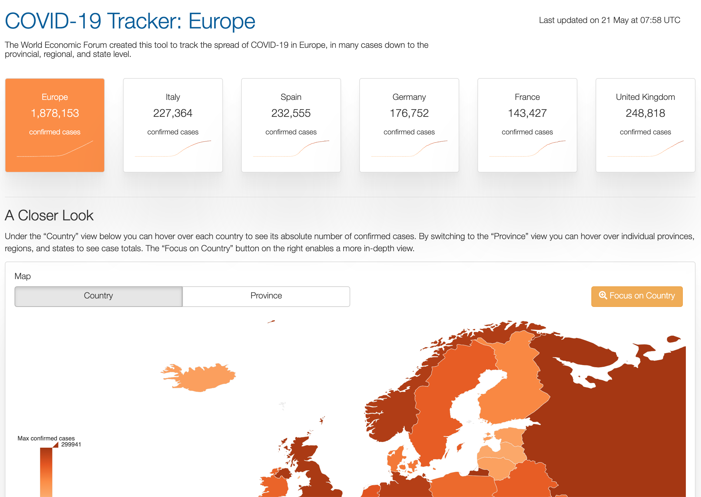

# COVID-19 European tracker

## About this project

The project's overarching objective is to present a simple, reproducible framework that can inspire future solutions to the problem of sharing consistently structured data.

While many existing visualizations track the virus' spread to European countries and provide country-level statistics, the focus of this project is to provide both country-level information for all European states in addition to provincial and regional figures where available.

A programmatic pipeline has been built to extract and process the data in a fully automated way, such as to ensure scalability as we add new data sources, full reproducibility, and minimize the risk for manual errors. It allows us to provide the data back to the community in a structured format through various [API endpoints](#api).

## About this repository

The repository contains the code and utilities needed to build and run the [World Economic Forum Strategic Intelligence COVID-19 Europe tracker](https://tracker.weforum.org/). The project was featured in this [article](https://www.weforum.org/agenda/2020/04/covid-19-this-tool-tracks-coronavirus-path-in-europe/) of the World Economic Forum's Agenda.

The project is arranged into two R packages. The first one, *covid.crawler*, establishes an ETL framework to crawl, structure and store the data from multiple heteroclite sources into a Postgres database. It also provides the utilities to promote the access to the databases to API endpoints. The second package contains two shiny applications, one that supports the actual [COVID-19 tracker](https://tracker.weforum.org/), the other one that supports the embedded charts made available in the tracker.



## Install

Both packages can be installed using `remotes`:

```r
# install with remotes
install.packages("remotes")
remotes::install_github("forum-intelligence/covid-eu-tracker/covid.crawler") # crawler
remotes::install_github("forum-intelligence/covid-eu-tracker/covid.tracker") # tracker
```

You can also clone the repository and install the packages individually with `remotes` or `devtools`. In particular, this is the recommended approach if you want to use Docker to deploy the project.

```r
# install with remotes
install.packages("remotes")

# crawler
setwd("./covid.crawler")
remotes::install_local()

# tracker
setwd("./covid.tracker")
remotes::install_local()
```

## Setup

To get started you need an installation of R, nodejs and a Postgres database.

The connections to the databases are established through configuration variables which are stored, for each package, in configuration files with identical names: `_covid.yml`.

In the `covid.crawler` package, you can run the below utility function:

```r
covid.crawler::create_config()
```

This will create a `_covid.yml` file with the following content for you to update:

```yaml
prod:
  dbname: db
  user: username
  password: pwd
  host: 127.0.0.1
dev:
  dbname: db
  user: username
  password: pwd
  host: 127.0.0.1
```

This above configuration allows using two databases, one for development purposes, and another one for production. Because the format, structure, and availability of the data sources have historically
changed more than once, we recommend to always run the crawler in dev before pushing to prod.

In the `covid.tracker` package, there is no distinction between the dev and prod environments. The `_covid.yml` file sets the following variables:

```r
dbname: db
user: username
password: pwd
host: 127.0.0.1
```

## Crawling the data sources

:exclamation: In order to run the crawler, you need to have a Postgres database set-up, the access to which is specified in in your configuration files (see [Setup](#setup)).

Due to the lack of a common set of principles for formatting, structuring and distributing data accross different countries, the daily crawl of the data is admittedly the most challenging part of this project. The package `covid.crawler` establishes a framework for automating, as a much as possible, the ETL process for all the data sources used in the project. It provides the data back to the community in a single and consistent structure accross all countries and aggregation levels (see [API](#api)).

⚡ Despite the crawling being automated, the format and structure of the source data have changed in the past. Therefore, if you run into any issue when running the crawler, please ensure you have the latest version of the code before opening an issue. The code might have already been updated to meet the changes in a problematic data source.

Every distinct source of data is collected and stored in the database via its own function. These are wrapped into a single `crawl_covid` function.

In brief, to collect and store the data, one should run:

```r
covid.crawler::crawl_covid()
```

## Special Cases

### Switzerland and the United Kingdom

Due to the way the data for Switzerland is made available, it must be crawled using nodejs called from R. It therefore requires an installation of nodejs as well as the `fs` and `puppeteer` modules, ideally installed _globally_ (make sure to specify the `g` flag as shown below).

```bash
npm i fs puppeteer -g
```

For the United Kingdom, most of the data is made available through a downloadable csv file. However, the latter is missing the total confirmed cases for Ireland, Scotland and Whales presented on the 
official [governmental website](https://coronavirus.data.gov.uk/). These missing data points are recovered using the same nodejs approach as for Switzerland.

If you want to learn more, you can check the `add_uk` `add_switzerland` functions.

## Running the app

We deployed our own instance of the project using Docker. It is however possible to run the app locally. 

### From R

Make sure your configuration files are correctly updated. Run `covid.tracker::run_embeds()` to launch the application which supports the embedded charts. Then run the actual tracker app. Note that it takes an `embed_url` argument to specify the base URL of the application that runs the embedded charts.

```r
covid.tracker::run_embeds()
covid.tracker::run_app()
```

### Using Docker

Leave the `_covid.yml` file at the root of the /covid.tracker directory. Fron the root of the project, where the file `docker-compose.yml` sits, run `docker-compose up` to run _both apps_ from a single image.

You must also update the `embed_url` argument in the `docker-compose.yml` file.

## API

The applications make use of an API framwework that makes all the structured country data available through endpoints. The API sits in the `covid.crawler` package, in the `inst/api` directory.

```bash
cd ./covid.crawler/inst/api/  
```

You can then run the API locally from R with:

```r
# install.packages("plumber")
library(plumber)
pr <- plumber::plumb('plumber.R')
pr$run()
```

If you are deploying using the Docker approach, build the image from the same directory:

```bash
docker build -t covidapi .
```

Once the image built, you can run it with:

```bash
docker run -p 3000:3838 covidapi
```

## Code of Conduct

Please note that the covid-tracking project is released with a [Contributor Code of Conduct](https://contributor-covenant.org/version/2/0/CODE_OF_CONDUCT.html). By contributing to this project, you agree to abide by its terms.

## License

This project is released under an [AGPLv3 license](https://www.gnu.org/licenses/agpl-3.0.en.html).
